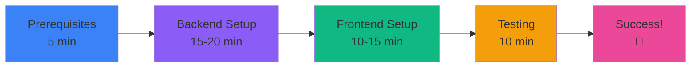

# 🗺️ DevPilot AI - Execution Roadmap

**Total Estimated Time:** 30-40 minutes  
**Skill Level Required:** Beginner-Friendly  
**Prerequisites:** Python 3.11+, Node.js 18+, Bob API Key

---

## 📊 Phase Overview



---

## ⏱️ Detailed Timeline

### Phase 1: Prerequisites Check (5 minutes)

**Time:** 0:00 - 0:05

**Tasks:**
- [ ] Verify Python 3.11+ installed
- [ ] Verify Node.js 18+ installed
- [ ] Verify npm 9+ installed
- [ ] Have Bob/Cline API key ready
- [ ] Open 2 terminal windows

**Commands:**
```bash
python --version    # Should show 3.11+
node --version      # Should show 18+
npm --version       # Should show 9+
```

**Success Criteria:**
✅ All version checks pass  
✅ API key starts with `bob_prod_`  
✅ Two terminals ready

---

### Phase 2: Backend Setup (15-20 minutes)

**Time:** 0:05 - 0:25

#### Step 2.1: Environment Setup (2 min)
**Time:** 0:05 - 0:07

```bash
cd backend
cp .env.example .env
# Edit .env and add your Bob API key
```

**Success:** `.env` file created with valid API key

---

#### Step 2.2: Virtual Environment (3 min)
**Time:** 0:07 - 0:10

**Windows:**
```bash
python -m venv venv
venv\Scripts\activate
```

**Mac/Linux:**
```bash
python3 -m venv venv
source venv/bin/activate
```

**Success:** Terminal shows `(venv)` prefix

---

#### Step 2.3: Install Dependencies (5-7 min)
**Time:** 0:10 - 0:17

```bash
pip install --upgrade pip
pip install -r requirements.txt
```

**What's Installing:**
- FastAPI & Uvicorn (web framework)
- OpenAI SDK (AI integration)
- ChromaDB (vector database)
- SQLAlchemy (database ORM)
- LangChain (AI orchestration)
- PyGithub (GitHub API)
- ~45 packages total

**Success:** All packages installed without errors

---

#### Step 2.4: Test API Connection (1 min)
**Time:** 0:17 - 0:18

```bash
python test_api.py
```

**Expected Output:**
```
[SUCCESS] Bob API is working!
[Response] Hello from DevPilot AI!
```

**Success:** API test passes

---

#### Step 2.5: Start Backend Server (1 min)
**Time:** 0:18 - 0:19

```bash
uvicorn app.main:app --reload --port 8000
```

**Expected Output:**
```
[DevPilot] Starting DevPilot AI Backend...
[DevPilot] Database initialized
INFO: Application startup complete.
```

**Success:** Server running, no errors

---

#### Step 2.6: Verify Backend (1 min)
**Time:** 0:19 - 0:20

**Open in browser:** http://localhost:8000/docs

**Success:** Swagger UI loads with API documentation

---

### Phase 3: Frontend Setup (10-15 minutes)

**Time:** 0:20 - 0:35

#### Step 3.1: Environment Setup (1 min)
**Time:** 0:20 - 0:21

**Open NEW terminal** (keep backend running)

```bash
cd frontend
cp .env.local.example .env.local
```

**Success:** `.env.local` file created

---

#### Step 3.2: Install Dependencies (5-7 min)
**Time:** 0:21 - 0:28

```bash
npm install
```

**What's Installing:**
- Next.js 14 (React framework)
- TailwindCSS (styling)
- Monaco Editor (code display)
- Mermaid.js (diagrams)
- shadcn/ui (components)
- ~200+ packages total

**Success:** All packages installed without errors

---

#### Step 3.3: Start Frontend Server (1 min)
**Time:** 0:28 - 0:29

```bash
npm run dev
```

**Expected Output:**
```
▲ Next.js 14.2.18
- Local:        http://localhost:3000
✓ Ready in 2.5s
```

**Success:** Server running on port 3000

---

#### Step 3.4: Verify Frontend (1 min)
**Time:** 0:29 - 0:30

**Open in browser:** http://localhost:3000

**Success:** Landing page loads with gradient design

---

### Phase 4: Testing & Verification (10 minutes)

**Time:** 0:30 - 0:40

#### Test 4.1: GitHub Analysis (3 min)
**Time:** 0:30 - 0:33

1. Enter URL: `https://github.com/pallets/flask`
2. Click "Analyze Repository"
3. Wait 10-30 seconds
4. Workspace page loads

**Success:** Repository analyzed, workspace page shows

---

#### Test 4.2: Illustration Mode (2 min)
**Time:** 0:33 - 0:35

1. Click "Illustration" mode
2. Query: "Generate an architecture diagram"
3. Wait for response

**Success:** Mermaid diagram renders

---

#### Test 4.3: Development Mode (2 min)
**Time:** 0:35 - 0:37

1. Click "Development" mode
2. Query: "Review code quality"
3. Wait for response

**Success:** Code review appears with suggestions

---

#### Test 4.4: Testing Mode (1 min)
**Time:** 0:37 - 0:38

1. Click "Testing" mode
2. Query: "Generate unit tests"

**Success:** Test code appears in Monaco Editor

---

#### Test 4.5: Other Modes (2 min)
**Time:** 0:38 - 0:40

Quick test of:
- Deployment mode (Dockerfile generation)
- Documentation mode (README generation)

**Success:** All modes respond correctly

---

## ✅ Final Verification Checklist

### Backend ✓
- [ ] Server running on port 8000
- [ ] API docs accessible at /docs
- [ ] Health endpoint responds
- [ ] No errors in terminal
- [ ] Database initialized

### Frontend ✓
- [ ] Server running on port 3000
- [ ] Landing page loads
- [ ] No errors in browser console
- [ ] Can navigate between pages

### Integration ✓
- [ ] GitHub analysis works
- [ ] All 5 AI modes respond
- [ ] Mermaid diagrams render
- [ ] Monaco Editor displays code
- [ ] Copy/download functions work

### Performance ✓
- [ ] GitHub analysis: 10-30 seconds
- [ ] AI queries: 2-5 seconds
- [ ] Page loads: <2 seconds
- [ ] No memory leaks

---

## 🎯 Success Metrics

### Must Have (Critical)
✅ Backend starts without errors  
✅ Frontend starts without errors  
✅ Can analyze GitHub repositories  
✅ At least 3 AI modes work  
✅ No console errors

### Should Have (Important)
✅ All 5 AI modes work  
✅ Mermaid diagrams render  
✅ Monaco Editor works  
✅ Meeting transcript processing  
✅ Query history saves

### Nice to Have (Optional)
✅ Fast response times (<5s)  
✅ Smooth animations  
✅ Mobile responsive  
✅ Dark mode looks good

---

## 🚨 Common Blockers & Solutions

### Blocker 1: API Key Invalid
**Symptom:** 401 Unauthorized error  
**Time Lost:** 5 minutes  
**Solution:** Get fresh key from Cline extension  
**Prevention:** Test API key before starting

### Blocker 2: Port Already in Use
**Symptom:** "Address already in use" error  
**Time Lost:** 2 minutes  
**Solution:** Use different port or kill process  
**Prevention:** Check ports before starting

### Blocker 3: Dependencies Fail to Install
**Symptom:** pip/npm errors during install  
**Time Lost:** 10 minutes  
**Solution:** Update pip/npm, clear cache  
**Prevention:** Use latest Python/Node versions

### Blocker 4: Can't Connect Frontend to Backend
**Symptom:** Network errors in browser  
**Time Lost:** 5 minutes  
**Solution:** Verify backend URL in .env.local  
**Prevention:** Double-check configuration files

---

## 📈 Progress Tracking

Use this to track your progress:

```
Phase 1: Prerequisites        [    ] 0%
Phase 2: Backend Setup        [    ] 0%
Phase 3: Frontend Setup       [    ] 0%
Phase 4: Testing              [    ] 0%

Overall Progress:             [    ] 0%
```

Update as you complete each phase:
- Phase 1 complete: 25%
- Phase 2 complete: 50%
- Phase 3 complete: 75%
- Phase 4 complete: 100% 🎉

---

## 🎓 Learning Outcomes

By completing this setup, you will have:

✅ **Technical Skills:**
- Set up Python virtual environments
- Configured FastAPI backend
- Built Next.js frontend
- Integrated AI APIs
- Used vector databases

✅ **DevOps Skills:**
- Environment configuration
- Dependency management
- Local development setup
- API testing
- Debugging techniques

✅ **AI/ML Skills:**
- RAG pipeline understanding
- Vector embeddings
- AI orchestration
- Prompt engineering
- Multi-modal AI systems

---

## 🚀 Next Steps After Setup

### Immediate (Day 1)
1. Analyze 3-5 different repositories
2. Try all AI modes with various queries
3. Process a real meeting transcript
4. Explore the generated outputs

### Short Term (Week 1)
1. Customize AI prompts for your needs
2. Add your own repositories
3. Create documentation for your projects
4. Generate tests for your code

### Long Term (Month 1)
1. Integrate into daily workflow
2. Customize UI/UX preferences
3. Add new AI modes
4. Share with team members

---

## 📞 Support Resources

### Documentation
- [COMPLETE_SETUP_GUIDE.md](COMPLETE_SETUP_GUIDE.md) - Detailed instructions
- [QUICK_REFERENCE.md](QUICK_REFERENCE.md) - Quick commands
- [README.md](README.md) - Project overview
- [IMPLEMENTATION_STATUS.md](IMPLEMENTATION_STATUS.md) - Current status

### Quick Help
- **Backend Issues:** Check backend terminal logs
- **Frontend Issues:** Check browser console
- **API Issues:** Run `python test_api.py`
- **Connection Issues:** Verify both servers running

### Emergency
If completely stuck:
1. Stop all servers (Ctrl+C)
2. Delete `venv`, `node_modules`, `.next`
3. Start fresh from Phase 2

---

## 🎉 Completion Celebration

When you see this, you're done! 🎊

```
✅ Backend: http://localhost:8000 ✓
✅ Frontend: http://localhost:3000 ✓
✅ API Docs: http://localhost:8000/docs ✓
✅ All Tests Passing ✓
✅ No Errors ✓

🎉 DevPilot AI is ready to use! 🎉
```

**Time to celebrate your new AI-powered development workspace!**

---

**Estimated Total Time:** 30-40 minutes  
**Actual Time:** _____ minutes  
**Blockers Encountered:** _____  
**Overall Experience:** ⭐⭐⭐⭐⭐

---

Made with ❤️ by DevPilot AI Team